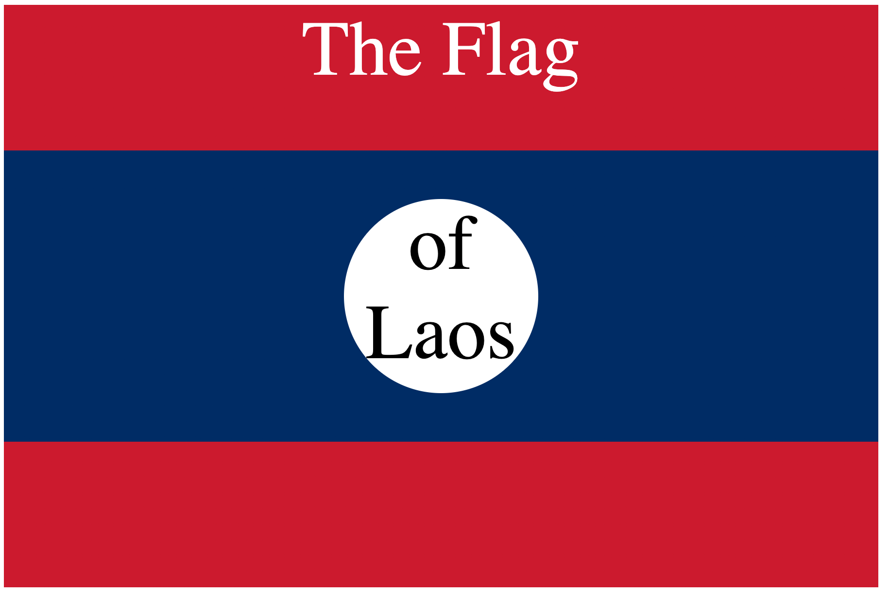

<div align="center">

# CSS Flag — Flag of Laos

**A pixel-perfect recreation of the national flag of Laos — built with pure CSS and three nested `<div>` elements.**

[](https://css-flag-laos.vercel.app/)
[](https://developer.mozilla.org/en-US/docs/Web/HTML)
[](https://developer.mozilla.org/en-US/docs/Web/CSS)
[](https://vercel.com/)

</div>

---

## 🔗 Live Demo

> 🌐 **[https://css-flag-laos.vercel.app/](https://css-flag-laos.vercel.app/)**

---

## 📖 Overview

This project is a **pure CSS challenge** — recreating the flag of Laos using only three nested `<div>` elements and CSS selectors. No images, no SVG, no extra classes or IDs.

The flag is rendered at **900×600px**, centered on screen, and consists of:
- 🔴 Two horizontal **red bands** (top and bottom)
- 🔵 One wide **blue band** in the center
- ⚪ A **white circle** centered on the blue band

> 🎯 **The challenge:** Produce the exact result using only CSS combinators and selectors on the existing HTML structure — without modifying the HTML.

---

## 🏁 Flag Composition

| Layer | CSS Selector | Visual |
|---|---|---|
| Outer `div` | `.flag` | 🔴 Red background (`#CE1126`), 900×600px |
| Middle `div` | `.flag > div` | 🔵 Blue band (`#002868`), absolutely positioned |
| Inner `div` | `.flag > div div` | ⚪ White circle via `border-radius: 50%` |

---

## ⚙️ Tech Stack

| Technology | Role |
|---|---|
|  | Three nested `<div>` elements — the only markup |
|  | Colors, positioning, and `border-radius` |

---

## 📂 Project Structure

```
css-flag-laos/
├── index.html        — Flag page with your CSS solution
├── solution.html     — Reference implementation
└── goal.png          — Target visual to replicate
```

---

## 🚀 Getting Started

No build step. No dependencies. Just open in a browser.

```bash
# Clone the repository
git clone https://github.com/SAPTARSHI-coder/css-flag-laos.git

# Open in browser
open index.html
```

Or simply visit the **[live deployment ↗](https://css-flag-laos.vercel.app/)**.

---

## 🧠 Key CSS Concepts

| Concept | Usage |
|---|---|
| `position: relative` / `position: absolute` | Layering the flag bands and circle |
| `border-radius: 50%` | Rendering a circle from a `<div>` |
| **Child combinator** (` > `) | Targeting `.flag > div`, `.flag > div div` |
| **CSS Specificity** | Overriding styles without classes or IDs |

---

## 🎨 Color Palette

<table>
  <tr>
    <td></td>
    <td><strong>Red</strong> — <code>#CE1126</code></td>
    <td>Top and bottom bands</td>
  </tr>
  <tr>
    <td></td>
    <td><strong>Blue</strong> — <code>#002868</code></td>
    <td>Center horizontal band</td>
  </tr>
  <tr>
    <td></td>
    <td><strong>White</strong> — <code>#FFFFFF</code></td>
    <td>Centered circle</td>
  </tr>
</table>

---

## 📸 Preview



---

<div align="center">

Made with ❤️ and pure CSS 

</div>
